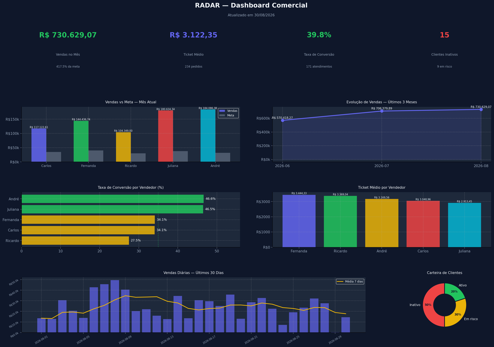

# RADAR — Dashboard Comercial

Dashboard em Python que transforma CSVs de varejo em um painel de KPIs: vendas vs meta, conversão, ticket médio e carteira de clientes.



## O que faz

Gera uma imagem única (`output/dashboard_radar.png`) com:

| KPI | O que mostra |
|-----|----------------|
| Vendas vs Meta | Comparativo por vendedor no mês atual |
| Evolução mensal | Tendência dos últimos 3 meses |
| Taxa de conversão | % de atendimentos que viraram venda |
| Ticket médio | Valor médio por pedido, por vendedor |
| Vendas diárias | Últimos 30 dias + média móvel de 7 dias |
| Carteira | Clientes ativos, em risco e inativos |

Os CSVs em `data/` são simulados (`gerar_dados.py`) — o fluxo é o mesmo se você trocar pelos seus arquivos.

## Como rodar

```bash
pip install -r requirements.txt
python gerar_dados.py   # opcional se os CSVs em data/ já existirem
python dashboard.py
```

Requer Python 3.10+ (pandas, matplotlib, numpy).

## Saída

O script imprime o caminho do arquivo e abre a figura. O PNG fica em:

```
output/dashboard_radar.png
```

## Stack


```
radar/
├── gerar_dados.py     # dados simulados → data/*.csv
├── dashboard.py       # KPIs + gráficos → output/dashboard_radar.png
├── data/              # vendas, atendimentos, clientes, metas
└── output/            # dashboard exportado
```

## Licença

MIT — © Milton Souza Macedo Junior. Veja [LICENSE](LICENSE).
